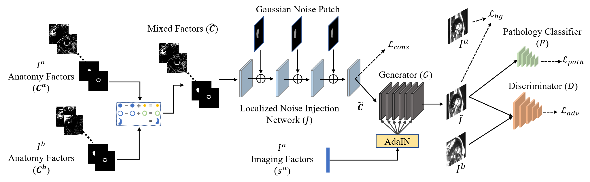
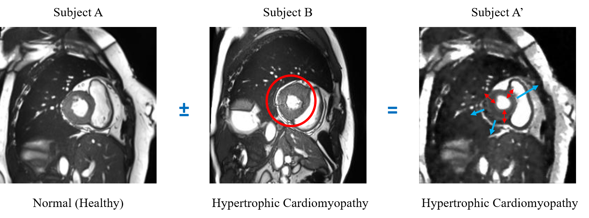
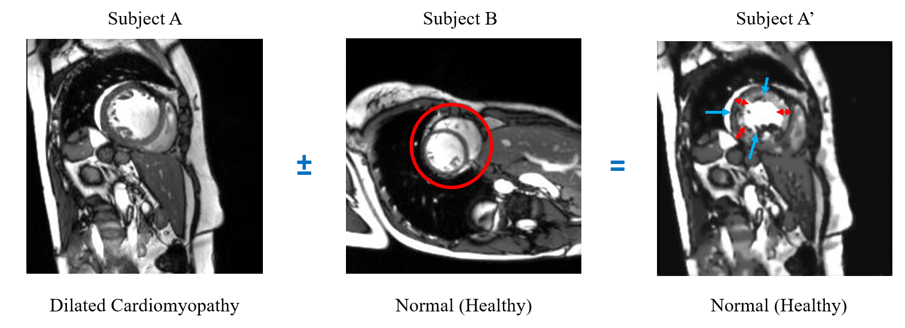
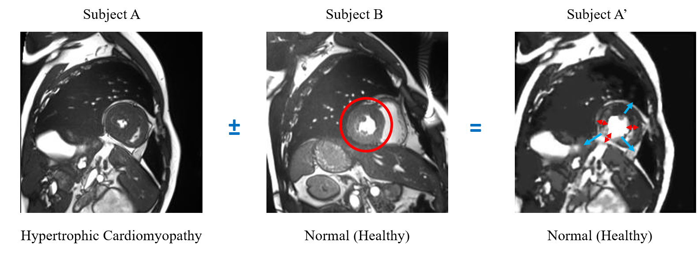

# Controllable cardiac synthesis via disentangled anatomy arithmetic
This repository consists of the basic implementation of DAA-GAN with two discriminator variants and a use case with cardiac MRI data from the ACDC dataset.



## Abstract
Acquiring annotated data at scale with rare diseases or conditions remains a challenge. It would be extremely useful to have a method that controllably synthesizes images that can correct such underrepresentation. Assuming a proper latent representation, the idea of a "latent vector arithmetic" could offer the means of achieving such synthesis. A proper representation must encode the fidelity of the input data, preserve invariance and equivariance, and permit arithmetic operations. Motivated by the ability to disentangle images into spatial anatomy (tensor) factors and accompanying imaging (vector) representations, we propose a framework termed "disentangled anatomy arithmetic", in which a generative model learns to combine anatomical factors of different input images such that when they are re-entangled with the desired imaging modality (e.g. MRI), plausible new cardiac images are created with the target characteristics. To encourage a realistic combination of anatomy factors after the arithmetic step, we propose a localized noise injection network that precedes the generator. Our model is used to generate realistic images, pathology labels, and segmentation masks that are used to augment the existing datasets and subsequently improve post-hoc classification and segmentation tasks.

## Requirements
* pytorch 1.7.0 (or later)
* python 3.7.2
* CUDA toolkit 11.0
* [visdom](https://github.com/fossasia/visdom) - loss plots, heatmaps, etc.
* Other packages: nibabel, numpy, scikit-image, matplotlib, opencv-python

## Factor extraction (SDNet)
To extract anatomical and imaging factors from the ACDC samples, use the SDNet model provided either from the [original repo](https://github.com/vios-s/anatomy_modality_decomposition) in Keras from [Agis85](https://github.com/agis85) (both fully-supervised and semi-supervised implementations) or from the in-lab PyTorch implementation in [this repo](https://github.com/spthermo/SDNet) from [spthermo](https://github.com/spthermo) (only the fully-supervised case is currently available). The extracted factors should be saved in ".npz" format as "anatomy_factors.npz" and "modality_factors.npz under the "/factors_npz" directory.

## Training
To train the model execute the following:
```
python train.py --gpu 0 --batch_size XX --epochs XX --data_path /path/to/ACDC --load_vgg_weights_path checkpoints/pretrained-vgg-like-model --load_factors_path factors_npz
```
The pretrained VGG-like pathology classifier can be downloaded from [here](https://drive.google.com/file/d/1PIrwg7pXFJP1nIYlfboO5yg9iwCETxUE/view?usp=sharing).

The visualizer will pint the 8095 port of the localhost to send the visualization information. To view the loss function plots, as well as the input and the generated images execute the following:
```
visdom -p 8095
```

The current implementation uses the LSGAN discriminator implementation. To train with the [SN-GAN discriminator](https://github.com/godisboy/SN-GAN) run the "train.py" script with the following argument:
```
--dtype spectral
```

To load the DAA-GAN generator weights from the SDNet pretrained model (the script will set the generator module to eval()) add the following argument:
```
--load_sdnet_decoder_weights_path checkpoints/add-the-pretrained-sdnet-model
```

## Test
To test the trained DAA-GAN execute the following:
```
python test.py --gpu 0 --data_path /path/to/ACDC --load_vgg_weights_path checkpoints/pretrained-vgg-like-model --load_factors_path factors_npz --load_weights_path checkpoint/add-the-pretrained-daa-gan-model
```

Running the test script will save the input, generated and factor images under the directory "reporting". Note that the performance of DAA-GAN is critically affected by the quality of the encoded anatomy factors, as well as of the plausibility of the mixed pathologies.

## Examples (visuals)






## Citation
If refer to the paper or use this code and/or models, please cite the following:
```
@inproceedings{thermos2021miccai,
  author       = "Spyridon Thermos and Xiao Liu and Alison O'Neil and Sotirios A. Tsaftaris",
  title        = "Controllable cardiac synthesis via disentangled anatomy arithmetic",
  booktitle    = "MICCAI",
  year         = "2021"
}
```

## License
All material except for the SDNet part, ACDC loader, and the SN-GAN discriminator module is made available under the [Creative Commons BY-NC 4.0](https://creativecommons.org/licenses/by-nc/4.0/) license.
